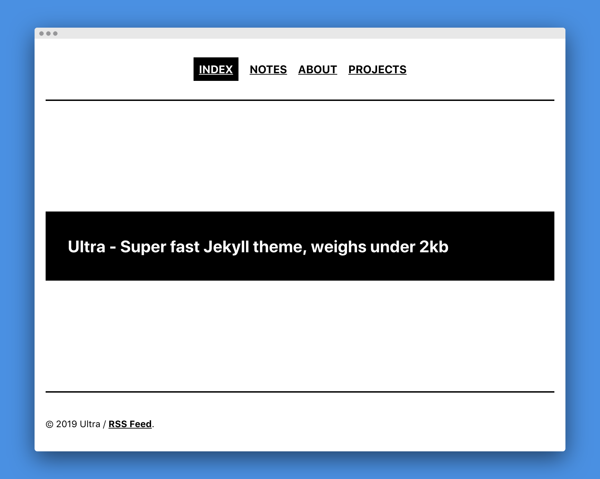

# Ultra - Super fast Jekyll theme

Super fast, minimal one-column portfolio/blog theme built for Jekyll. Theme weighs under <strong>2kb</strong>. Perfect for your personal website, blog and portfolio.

### Key features

- seo optimized
- weighs under 2kb
- portfolio/blog pages
- AAA, 100/100 scores on Lighthouse, Gmetrix and Webpagetest
- responsive
- inline css
- compressed css, html
- sitemap
- robots.txt
- atom feed

# Demo [here](https://ultra-jekyll.netlify.com/)